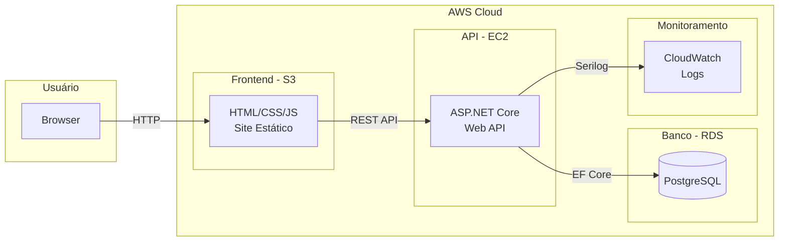
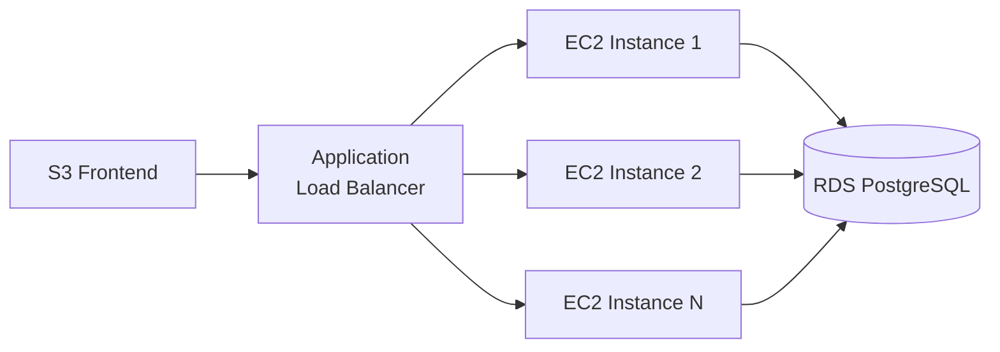

# TechStore Cloud — Sistema de Cadastro de Produtos

MVP de um sistema de cadastro de produtos em arquitetura de microsserviços na AWS, desenvolvido para avaliação acadêmica de Engenharia de Software e Cloud Computing.

## Arquitetura



## Estrutura do Projeto

```
projeto3/
├── frontend/               # Frontend estático (S3)
│   ├── index.html
│   ├── css/style.css
│   └── js/app.js
├── api/                     # Backend .NET 8
│   ├── TechStoreCloud.Api/  # API REST
│   │   ├── Controllers/     # Endpoints HTTP
│   │   ├── Services/        # Regras de negócio
│   │   ├── Repositories/    # Acesso a dados
│   │   ├── DTOs/            # Data Transfer Objects
│   │   ├── Models/          # Entidades do domínio
│   │   ├── Data/            # DbContext e configuração
│   │   └── Middleware/      # Tratamento de erros
│   └── TechStoreCloud.Tests/ # Testes unitários
├── infra/                   # Infraestrutura
│   ├── Dockerfile
│   ├── docker-compose.yml
│   ├── deploy-aws.sh
│   └── cloudformation/
│       └── template.yaml
├── docs/
│   └── decisoes-arquiteturais.md
└── README.md
```

## Tecnologias

| Componente | Tecnologia | Serviço AWS |
|------------|-----------|-------------|
| Frontend | HTML/CSS/JS puro | Amazon S3 |
| API | .NET 8 / ASP.NET Core | Amazon EC2 |
| Banco de dados | PostgreSQL + EF Core | Amazon RDS |
| Monitoramento | Serilog | CloudWatch Logs |
| Infraestrutura | Docker + CloudFormation | EC2, RDS, S3 |

## Como Rodar Localmente

### Pré-requisitos

- [Docker](https://docs.docker.com/get-docker/) e Docker Compose
- (Opcional) [.NET 8 SDK](https://dotnet.microsoft.com/download/dotnet/8.0) para desenvolvimento

### Subir o ambiente completo

```bash
cd infra
docker-compose up --build
```

Isso inicia:
- **PostgreSQL** na porta `5432`
- **API** na porta `5000` (Swagger: http://localhost:5000/swagger)
- **Frontend** na porta `8080` (http://localhost:8080)

### Rodar apenas a API (desenvolvimento)

```bash
# Subir apenas o banco
cd infra
docker-compose up postgres -d

# Rodar a API
cd ../api/TechStoreCloud.Api
dotnet run
```

### Rodar os testes

```bash
cd api
dotnet test
```

## API — Endpoints

| Método | Rota | Descrição |
|--------|------|-----------|
| GET | `/api/produtos` | Listar todos os produtos |
| GET | `/api/produtos/{id}` | Obter produto por ID |
| POST | `/api/produtos` | Cadastrar novo produto |
| PUT | `/api/produtos/{id}` | Atualizar produto |
| DELETE | `/api/produtos/{id}` | Excluir produto |

### Exemplo de payload (POST/PUT)

```json
{
  "nome": "Notebook Pro 15",
  "descricao": "Notebook com processador i7, 16GB RAM, 512GB SSD",
  "preco": 4599.90,
  "categoria": "Notebooks",
  "quantidadeEstoque": 25,
  "imagemUrl": null
}
```

## Deploy na AWS — Passo a Passo

### Pré-requisitos

- AWS CLI configurado (`aws configure`)
- Conta AWS com permissões para EC2, RDS, S3, CloudFormation, IAM

### 1. Deploy da infraestrutura

```bash
cd infra
chmod +x deploy-aws.sh
./deploy-aws.sh us-east-1 techstore-cloud
```

O script cria automaticamente:
- Bucket S3 com o frontend
- VPC com subnets públicas e privadas
- Instância EC2 (t2.micro) com Docker
- RDS PostgreSQL (db.t3.micro) em subnet privada
- CloudWatch Log Group
- Security Groups configurados

### 2. Configurar a API no EC2

```bash
# Conectar via SSH
ssh -i techstore-key.pem ec2-user@<EC2_PUBLIC_IP>

# Clonar o projeto ou copiar os arquivos
# Atualizar a connection string para apontar para o RDS
export DATABASE_URL="Host=<RDS_ENDPOINT>;Port=5432;Database=techstore;Username=techstore;Password=<SENHA>"

# Build e run via Docker
docker build -t techstore-api -f infra/Dockerfile .
docker run -d -p 5000:5000 \
  -e "ConnectionStrings__DefaultConnection=$DATABASE_URL" \
  -e "ASPNETCORE_ENVIRONMENT=Production" \
  --name techstore-api \
  techstore-api
```

### 3. Atualizar o frontend

Edite `frontend/js/app.js` e altere `API_URL` para o IP/DNS do EC2:

```javascript
const API_URL = 'http://<EC2_PUBLIC_IP>:5000/api/produtos';
```

Re-upload para o S3:

```bash
aws s3 sync frontend/ s3://<BUCKET_NAME>/ --delete
```

### 4. Configurar CloudWatch (produção)

Adicione ao `appsettings.json` em produção:

```json
{
  "Serilog": {
    "WriteTo": [
      { "Name": "Console" },
      {
        "Name": "AWSSeriLog",
        "Args": {
          "logGroup": "/techstore/api",
          "region": "us-east-1"
        }
      }
    ]
  }
}
```

## Escalabilidade

A arquitetura permite escalar horizontalmente:



- **Auto Scaling Group:** múltiplas instâncias EC2 atrás de um ALB
- **RDS:** suporta Read Replicas para leitura
- **S3:** escala automaticamente para servir o frontend
- **CloudWatch:** centraliza logs de todas as instâncias

## Modelo de Dados

```
Produto
├── Id (GUID, PK)
├── Nome (string, max 200, obrigatório)
├── Descricao (string, max 2000)
├── Preco (decimal 18,2)
├── Categoria (string, max 100, obrigatório)
├── QuantidadeEstoque (int, >= 0)
├── ImagemUrl (string, max 500, opcional)
├── Ativo (bool, default true)
├── CriadoEm (datetime)
└── AtualizadoEm (datetime)
```
